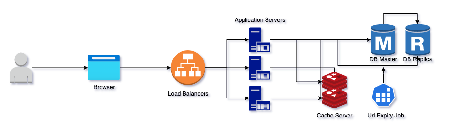

### Objective

Your assignment is to implement a URL shortening service using Ruby. You can use any framework you want (or no framework at all, it is up to you).

### Brief

ShortLink is a URL shortening service where you enter a URL such as https://codesubmit.io/library/react and it returns a short URL such as http://short.est/GeAi9K.

### [Solutions](/docs/solutions.md)

### System Architecture

### [Setup](/docs/setup.md)

### [API Docs](/docs/apis.md)

### Security Potential Issues:

- Attacker can create a shorten link to direct people to phishing websites. We need a function for users to report when detected to prevent and block similar links when required
- Attacker can create a link to force user auto download of malicious software. We can't really know that the link you have doesn't cause a file download (before you call the URL) because even a URL without a file extension can be linked to a file.
    - What you can do is check if the URL contains a file extension, and this can be done using the following code
    - Or create a background job to run in sandbox environment to check every suspicious url and prevent it.
- Validate url format to avoid XSS attack, mailto:, ssh:, slack:, file: link,…
- The capacity of Base62 is larger than Base58, but users can confuse or be fooled by similar links if we allow to customize the link. Zero "0" with capital "O". Capital "I" with lowercase "L". So I decide to use Base58 to avoid that problem.
- Provide preview url before clicking when when embedding the link in another app then they user can know where they will go.
- To avoid DDoS attacks, crawler and bots We can set request limit throttling. Avoid using sequence number ids. The limit is possible at load balances layer (ex: Nginx), application layer (middleware) or even setup a Cloudflare Rate Limiting.
- We should create user table to store user data and their url and easy for later restricting and tracking

### ****Scalability Issues****

Vertical scaling basically means the increase of server power – expansion of RAM, switch to a more powerful processor.

During the horizontal scaling, all software is switched from standard server architecture to a 3-tier architecture, which includes the following levels:

- Server with the load balancer
    - We will uses [Nginx](https://www.nginx.com/) as a load balancer, which executes intellectual distribution of computational tasks between servers. The processing of user requests with the involvement of the load balancer is subsequent, server-by-server.
- Web app instances
    - The most popular app servers currently are [Unicorn](https://github.com/defunkt/unicorn), [Puma](https://github.com/puma/puma), and [Phusion Passenger](https://www.phusionpassenger.com/)
- Database instances
    - I assume it will be 80/20 read/write ratio. So we need master-master replication to reserve 1 replica for reading to avoid bottleneck. Rails 6, has full support for multiple databases with Active Record, which means if you have read replica at your database
- Provide a cache layer like Redis  and using LRU (least recently used) to cache top url in a day.
- We need monitoring to monitor the health of the system and come up with solutions
